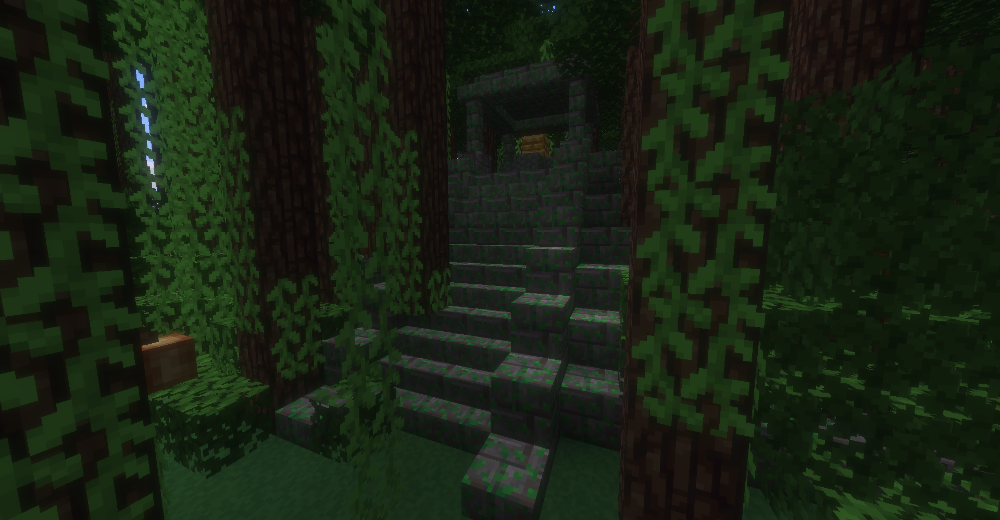

# Improved Jungle Temples for MineClone 2

This mod adds improved jungle temples to MineClone 2. It adds new structure designs, more hidden dangers, and better loot. In short, freshening up the boring old Jungle Temple Designs.

If you are ready to explore the jungle and face its many dangers, there is loot of excellent value hidden in the depths of these temples. However, the ancient builders of times before have laid many traps in an attempt to keep their treasure safe. Are you ready?

## Credits
* PrairieWind - For starting this project and doing the initial coding work and structure schematic creation.

## Contributing
If you wish to contribute to the improvement of the jungle temples, you can create new traps and floors and rooms. You just need to be knowledgable of minetest schematics, lua, and the mineclone2 structure api. Feel free to open a pull request to add your proposed changes.

## Issues
Report any bugs, crashes, suggestions, or issues on our [bug tracker](https://codeberg.org/PrairieWind/mcl_jungle_temple/issues).
